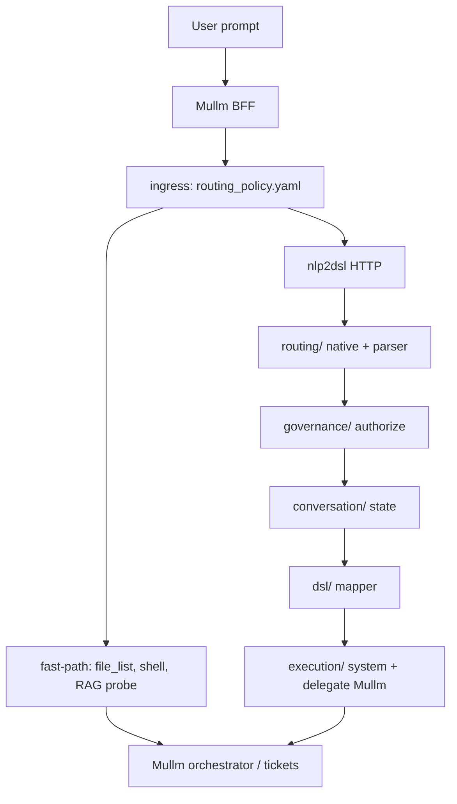

# Refaktor routingu nlp2dsl — plan modułowy

## Podział odpowiedzialności (docelowy)



| Warstwa | Repo | Odpowiedzialność | Nie robi |
|---------|------|------------------|----------|
| **Ingress** | Mullm `prompt_router` + `routing_policy.yaml` | Klasa ścieżki: RAG probe, fast-path, czy w ogóle wołać nlp2dsl | DSL, ACL akcji YAML |
| **Action router** | nlp2dsl `routing/` | Native intent, rules/LLM parse, intent → action | UI workspace, OpenRouter RAG |
| **Governance** | nlp2dsl `governance/` | `authorize_action`, access config, URI match | Mapowanie do DSL |
| **Conversation** | nlp2dsl `conversation/` | Stan rozmowy, merge entities, in_progress/ready | Wykonanie shell |
| **DSL** | nlp2dsl `dsl/` | `map_to_dsl`, formularze, missing fields | Routing ingress Mullm |
| **Execution** | nlp2dsl `execution/` + Mullm | system_executor, delegate → Mullm BFF | Ponowne parsowanie intencji |

**Zasada:** „lista plików usera” → **tylko Mullm** (`mullm_file_list`). nlp2dsl może mieć alias w `native_routing`, ale BFF nie powinien wołać nlp2dsl dla tej frazy (już w `chat.is_file_list_intent` + `prompt_router`).

---

## Stan dziś (hotspoty)

| Plik | CC / rola dziś | Docelowy moduł |
|------|----------------|----------------|
| `orchestrator.py` | `_process_message`, dialog flow | `conversation/orchestrator.py` (cienki facade) |
| `access/native.py` | `resolve_native_intent`, `_match_route` | `routing/native.py` |
| `access/policy.py` | `authorize_action` | `governance/policy.py` |
| `access/config.py` | `load_access_config` | `governance/config.py` |
| `access/uri_match.py` | URI ACL | `governance/uri_match.py` |
| `parsing/facade.py` + `parser_rules.py` + `parser_llm.py` | parse_text | `routing/parser/` |
| `mapper.py` | `map_to_dsl` | `dsl/mapper.py` |
| `system_executor.py` | natychmiastowe akcje system | `execution/system.py` |
| `registry.py` | ACTIONS_REGISTRY | `dsl/registry.py` (lub wspólny `domain/`) |
| `main.py` | HTTP + WebSocket + parser mode | `api/` — tylko transport |

`orchestrator._process_message` dziś łączy: native → auth → parse → merge → unknown → system → DSL → incomplete. To jest **pipeline do rozbicia**, nie do powielenia w Mullm.

---

## Model decyzji: `IntentDecision` (nlp2dsl)

Wspólny kontrakt dla native / rules / LLM (analogiczny do Mullm `RouteDecision`):

```python
@dataclass
class IntentDecision:
    action: str | None          # np. mullm_list_files, send_email
    intent: str                 # slug z parsera lub action
    confidence: float
    source: str                 # native_routing | rules | llm | unknown
    reason_codes: list[str]
    resource_area: str | None
    permission_action: str
    uri: str | None
    authorized: bool
    deny_reason: str | None
    candidate_actions: list[dict]  # opcjonalnie ranking
```

Zwracany przez `routing.resolve_intent(text, agent_id) -> IntentDecision` — **jedno** miejsce przed merge do stanu.

`ConversationResponse` może dostać opcjonalne pole `routing: dict` (debug dla Mullm UI), bez łamania API.

---

## Fazy wdrożenia

### Faza 0 — kontrakt z Mullm

- [x] Mullm `routing_policy.yaml` — ingress_order
- [x] `prompt_router` — nie wysyłać nlp2dsl dla `file_list`
- [x] nlp2dsl PR-A: `IntentDecision` + `routing.resolve_intent` + pole `routing` w `ConversationResponse`
- [x] Mullm: `nlp2dsl_routing` / `routing.nlp2dsl` w odpowiedzi conductor

### Faza 1 — wydzielenie bez zmiany zachowania (1–2 dni) ✅

**Cel:** przenieść pliki, zostawić re-exporty w starych ścieżkach.

1. Utwórz pakiety:
   ```
   nlp-service/app/routing/
     __init__.py      # resolve_intent()
     native.py        # z access/native.py
     parser/
       __init__.py    # parse_text (z parsing/facade)
       rules.py
       llm.py
   nlp-service/app/governance/
     config.py
     policy.py
     uri_match.py
   nlp-service/app/conversation/
     orchestrator.py  # przenieś logikę z orchestrator.py
     merge.py         # _merge_into_state
     responses.py     # _build_incomplete_response, unknown
   nlp-service/app/dsl/
     mapper.py
     forms.py         # get_action_form, FIELD_TYPES
   nlp-service/app/execution/
     system.py        # z system_executor.py
   ```

2. W starych plikach tylko:
   ```python
   # orchestrator.py → deprecated shim
   from app.conversation.orchestrator import *
   ```

3. Testy: istniejące testy nlp2dsl muszą przejść bez zmiany assertów.

**Kolejność plików (najmniej ryzyka):**

| Krok | Plik źródłowy | Akcja |
|------|---------------|--------|
| 1 | `access/config.py`, `uri_match.py` | → `governance/` |
| 2 | `access/policy.py` | → `governance/policy.py` |
| 3 | `access/native.py` | → `routing/native.py` |
| 4 | `parser_*.py`, `parsing/facade.py` | → `routing/parser/` |
| 5 | `mapper.py` + `FIELD_TYPES` z orchestrator | → `dsl/` |
| 6 | `system_executor.py` | → `execution/system.py` |
| 7 | `orchestrator.py` | → `conversation/orchestrator.py` + shim |

### Faza 2 — rozbicie conversation + pipeline w `routing/` ✅

- [x] `conversation/merge.py`, `conversation/responses.py` — orchestrator cienki
- [x] `routing.resolve_intent` — jedyny punkt native → parser → ACL (PR-A)
- [x] `orchestrator.py` shim < 25 linii

Zastąp w `conversation/orchestrator.py` blok 1a/1b (historycznie; zrobione przez `resolve_intent`):

```python
decision = await routing.resolve_intent(text, agent_id=get_agent_id())
if not decision.authorized:
    return deny_response(decision)
nlp = decision.to_nlp_result()
```

`routing/resolve_intent`:

1. `native.resolve_native_intent`
2. jeśli None → `parser.parse_text` (rules/auto/llm)
3. `governance.authorize_action` dla wybranej akcji
4. zwróć `IntentDecision`

**Usuń** bezpośrednie importy `authorize_action` z conversation — tylko przez routing facade.

### Faza 3 — observability ✅ (log-based MVP)

- [x] `routing/observability.py` — `record_intent_decision`, liczniki w `/health.routing_metrics`
- [x] Mullm PR-C: `nlp2dsl_bridge.intent_routing_policy_flags` → `RouteDecision.policy_flags`

### Faza 4 — `execution/delegate.py` ✅

- [x] `execution_backend_for_intent`, `delegate_payload` — używane w `conversation/responses.py`
- [ ] pełna integracja z Mullm `conductor._ready_action_payload` (następny krok)

---

## Co NIE przenosić do nlp2dsl

- RAG probe / `POST /api/rag/ask` — zostaje w Mullm (`routing_policy` krok `rag_probe`)
- Macierz ACL UI (`/access`) — Mullm BFF; nlp2dsl trzyma `nlp2dsl.yaml` action areas
- Auto-assign idle agent — orchestrator Mullm (`task_routing.py`)

## Synchronizacja konfiguracji

| Temat | Mullm | nlp2dsl |
|-------|-------|---------|
| Lista plików | `chat.py` + fast-path | alias w YAML (fallback gdy BFF ominie) |
| Shell ticket | `routing_policy` agents | `mullm_shell_task` delegate |
| ACL zasobów | `access_matrices.yaml` | `nlp2dsl.yaml` `resource_areas` |

Docelowo: jeden **źródłowy** plik grants (faza późniejsza) — na razie duplikacja aliasów jest OK jeśli BFF jest pierwszy.

---

## Kryteria sukcesu refaktoru

1. `orchestrator.py` (shim) < 50 linii
2. `_process_message` / `resolve_intent` — testowane jednostkowo bez FastAPI
3. „lista plikow usera” z Mullm **nie** wywołuje nlp2dsl (test integracyjny BFF)
4. nlp2dsl zwraca `IntentDecision` w API dla debugu
5. Brak regresji: workflow DSL, native routes, authorize deny

---

## Najbliższy PR (rekomendacja)

**PR-A (nlp2dsl, mały):** `IntentDecision` + `routing/resolve_intent` + pole `routing` w `ConversationResponse` — bez przenoszenia plików.

**PR-B (nlp2dsl, średni):** Faza 1 — przeniesienie pakietów + shims.

**PR-C (Mullm, mały):** ✅ `nlp2dsl_bridge` → `policy_flags` przy kroku `nlp2dsl`.

**Następny PR-D:** `api/` — wydzielenie transportu z `main.py`; opcjonalnie `dsl/registry.py`.
