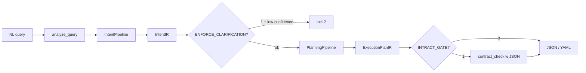
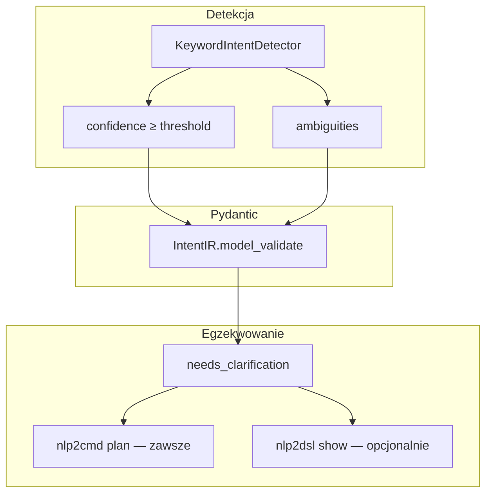
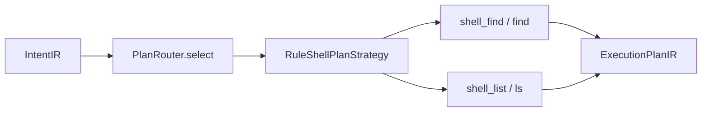

# Intract × nlp2dsl — walidacja planu

Pakiety IR (`pact-ir`, `nlp2cmd-intent`, `nlp2cmd-planner`) **nie zależą** od Intract. Kontrakty są egzekwowane w **nlp2cmd** przez `RuntimeBridge` i `PlanStepGate`, z wynikiem widocznym w `nlp2dsl show --plan`.

Szczegóły runtime: [nlp2cmd/docs/architecture/intract-integration.md](https://github.com/wronai/nlp2cmd/blob/main/docs/architecture/intract-integration.md)

## Przepływ `nlp2dsl show`



## IntentIR — co jest walidowane



| Pole | Rola |
|------|------|
| `intent` | Routing plannera + mapowanie kontraktu (`find` → `intent.file_search`) |
| `confidence` | Próg 0.5 dla `needs_clarification()` |
| `target_kind` | `shell` / `browser` / … → strategia planowania |
| `entities` | Parametry planu (regex w `RuleShellPlanStrategy`) |

## Planowanie (MVP)



Obsługiwane intencje shell (MVP): `file_search`, `find`, `search`, `list`, `ls`, `dir`.

## Zmienne środowiskowe (nlp2dsl)

| Zmienna | Domyślnie | Opis |
|---------|-----------|------|
| `NLP2CMD_INTRACT_GATE` | `0` | Dodaje `contract_check` do `show --plan` (wymaga zainstalowanego nlp2cmd) |
| `NLP2CMD_ENFORCE_CLARIFICATION` | `0` | `show` kończy się exit 2 przy niskiej pewności |

`nlp2cmd plan` zawsze egzekwuje `needs_clarification()` — bez dodatkowej flagi.

## Przykłady

```bash
# Struktura + plan (bez kontraktów)
nlp2dsl show "znajdź pliki *.py w src" --plan

# Plan + contract_check
export NLP2CMD_INTRACT_GATE=1
nlp2dsl show "znajdź pliki *.py w src" --plan

# Niska pewność — blokada
export NLP2CMD_ENFORCE_CLARIFICATION=1
nlp2dsl show "xyz"
```

## Pakiety

| Pakiet | Intract? |
|--------|----------|
| `pact-ir` | nie — tylko modele Pydantic |
| `nlp2cmd-intent` | nie — `ensure_intent_clear`, `IntentClarificationRequired` |
| `nlp2cmd-planner` | nie — reguły + regex |
| `nlp2dsl-show` | opcjonalnie — lazy import `PlanStepGate` z nlp2cmd |

## Post-execution (stdout)

Osobna warstwa w **nlp2cmd** — nie w pakietach IR. Porównuje stdout po `plan --execute` z oczekiwaniem (regex, min_lines, returncode).


| Zmienna | Efekt |
|---------|-------|
| `NLP2CMD_POST_CHECK=1` | Włącza post-check |
| `NLP2CMD_POST_CHECK_STRICT=1` | Naruszenia → exit 2 |

TestQL (`NLP2CMD_EMIT_TESTQL`) — dziś tylko browser/canvas z execution record; shell TestQL — roadmap.

Szczegóły: [nlp2cmd/docs/architecture/post-execution-validation.md](https://github.com/wronai/nlp2cmd/blob/main/docs/architecture/post-execution-validation.md)
