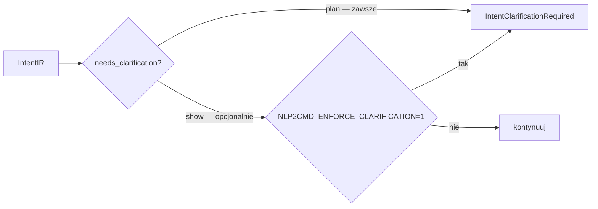

# nlp2cmd-intent

NL → **IntentIR**: normalizacja, detekcja intencji, encje.

Kanoniczna implementacja `KeywordIntentDetector` — nlp2cmd re-eksportuje ją z `nlp2cmd.generation.keywords`.

## Użycie

```python
from nlp2cmd_intent import IntentPipeline, analyze_query, ensure_intent_clear

intent = IntentPipeline().run("znajdź pliki *.py w src")
print(intent.intent, intent.target_kind, intent.confidence)

if intent.needs_clarification():
    # confidence < 0.5 lub niepuste ambiguities
    ...

ensure_intent_clear(intent, enforced=True)  # raises IntentClarificationRequired

structure = analyze_query("znajdź pliki *.py w src", include_plan=True)
```

### Egzekwowanie clarification



| Ścieżka | Zachowanie |
|---------|------------|
| `nlp2cmd plan` | zawsze blokuje przy niskiej pewności |
| `nlp2dsl show` | tylko z `NLP2CMD_ENFORCE_CLARIFICATION=1` |

Kontrakty Intract (plan steps) — w **nlp2cmd**, nie w tym pakiecie. Zob. [`docs/intract-integration.md`](../../docs/intract-integration.md).

## CLI (przez nlp2dsl-show)

```bash
nlp2dsl show "znajdź pliki *.py w src"
```

## Instalacja

```bash
pip install -e packages/pact-ir
pip install -e packages/nlp2cmd-intent
```

## Pliki danych

Bundlowane w `src/nlp2cmd_intent/data/`:

- `patterns.json`
- `keyword_intent_detector_config.json`

Override: `NLP2CMD_PATTERNS_FILE`, `NLP2CMD_DETECTOR_CONFIG_FILE`, `NLP2CMD_CONFIG_DIR`.
