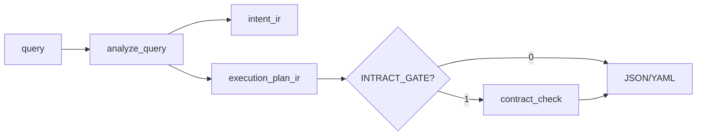

# nlp2dsl-show

CLI do podglądu **struktury zapytania** (IntentIR). Nie wykonuje poleceń.

UTF-8 jest konfigurowany automatycznie przy starcie (`configure_utf8()`).

## Instalacja

```bash
cd /path/to/nlp2dsl
./packages/install-dev.sh
```

## Użycie

```bash
nlp2dsl-show show "znajdź pliki *.py w src"
nlp2dsl-show show "znajdź pliki *.py w src" --plan
nlp2dsl-show show "wejdź na jspaint.app" --format yaml

# Kontrakty Intract (wymaga nlp2cmd + NLP2CMD_INTRACT_GATE=1)
export NLP2CMD_INTRACT_GATE=1
nlp2dsl-show show "znajdź pliki *.py w src" --plan   # pole contract_check w JSON

# Blokada niejednoznacznego zapytania
export NLP2CMD_ENFORCE_CLARIFICATION=1
nlp2dsl-show show "xyz"   # exit 2
```

### Przepływ `--plan`



| Exit code | Przyczyna |
|-----------|-----------|
| `0` | OK |
| `1` | `contract_check.passed == false` (tylko `--plan` + gate) |
| `2` | `IntentClarificationRequired` (z `ENFORCE_CLARIFICATION`) |

Alternatywnie (SDK z backend commands):

```bash
pip install -e .
nlp2dsl show "znajdź pliki *.py w src"
nlp2dsl demo invoice
```

## Kodowanie

Jeśli w terminalu widzisz `znajd?` zamiast `znajdź`:

```bash
export LANG=C.UTF-8
export PYTHONIOENCODING=utf-8
```

Lub wyłącz auto-fix: `NLP2DSL_UTF8=0`.
