# System Architecture Analysis
<!-- generated in 0.00s -->

## Overview

- **Project**: /home/tom/github/wronai/nlp2dsl
- **Primary Language**: python
- **Languages**: python: 51, yaml: 7, shell: 7, toml: 5, txt: 4
- **Analysis Mode**: static
- **Total Functions**: 298
- **Total Classes**: 47
- **Modules**: 92
- **Entry Points**: 215

## Architecture by Module

### nlp2dsl_sdk.client
- **Functions**: 51
- **Classes**: 2
- **File**: `client.py`

### nlp2dsl_sdk.demos
- **Functions**: 22
- **Classes**: 1
- **File**: `demos.py`

### tauri-wrapper.scripts.serve-dist
- **Functions**: 21
- **File**: `serve-dist.js`

### nlp-service.app.system_executor
- **Functions**: 13
- **File**: `system_executor.py`

### nlp-service.app.parser_rules
- **Functions**: 13
- **File**: `parser_rules.py`

### worker.worker
- **Functions**: 12
- **File**: `worker.py`

### nlp-service.app.orchestrator
- **Functions**: 12
- **File**: `orchestrator.py`

### backend.app.db.postgres
- **Functions**: 11
- **Classes**: 3
- **File**: `postgres.py`

### nlp-service.app.settings
- **Functions**: 11
- **Classes**: 6
- **File**: `settings.py`

### backend.app.routers.workflow
- **Functions**: 9
- **File**: `workflow.py`

### tauri-wrapper.scripts.dev
- **Functions**: 8
- **File**: `dev.js`

### nlp-service.app.audio_parser
- **Functions**: 8
- **Classes**: 1
- **File**: `audio_parser.py`

### nlp-service.app.code_generator
- **Functions**: 8
- **Classes**: 1
- **File**: `code_generator.py`

### backend.app.engine
- **Functions**: 7
- **File**: `engine.py`

### backend.app.routers.settings
- **Functions**: 7
- **File**: `settings.py`

### nlp-service.app.store.redis_store
- **Functions**: 7
- **Classes**: 1
- **File**: `redis_store.py`

### backend.app.logging_setup
- **Functions**: 6
- **Classes**: 2
- **File**: `logging_setup.py`

### backend.app.workflow_events
- **Functions**: 6
- **Classes**: 2
- **File**: `workflow_events.py`

### backend.app.db.memory
- **Functions**: 6
- **Classes**: 1
- **File**: `memory.py`

### backend.app.db
- **Functions**: 6
- **Classes**: 1
- **File**: `__init__.py`

## Key Entry Points

Main execution flows into the system:

### backend.app.routers.workflow.workflow_from_text
> Pełny pipeline: tekst → NLP → DSL → (opcjonalne) wykonanie.

Body: {"text": "...", "mode": "auto|rules|llm", "execute": true|false}
- **Calls**: router.post, body.get, body.get, body.get, nlp_resp.json, text.strip, HTTPException, AsyncClient

### backend.app.routers.workflow.stream_workflow
> SSE stream with live workflow lifecycle events.
- **Calls**: router.get, StreamingResponse, _repo.get_run, HTTPException, backend.app.routers.workflow._workflow_snapshot, event_generator, backend.app.routers.workflow._format_sse, snapshot.get

### backend.app.routers.chat.chat_message
> Kontynuuj konwersację — uzupełnij brakujące dane.

Body: {"conversation_id": "abc", "text": "klient@firma.pl"}
- **Calls**: router.post, resp.json, None.lower, backend.app.routers.chat._proxy_chat_payload, HTTPException, any, result.get, body.get

### nlp2dsl_sdk.demos.run_action_catalog_demo
- **Calls**: print, client.workflow_actions, print, NLP2DSLClient.from_env, nlp2dsl_sdk.demos._ensure_services, action.get, print, client.workflow_action_schema

### nlp-service.app.system_executor._exec_file_read
- **Calls**: config.get, nlp-service.app.system_executor._validate_file_path, None.read_text, config.get, config.get, None.exists, None.is_file, content.split

### nlp-service.app.system_executor._exec_file_list
- **Calls**: config.get, config.get, sorted, candidate.exists, Path, resolved.rglob, str, len

### worker.worker.handle_generate_code
- **Calls**: worker.worker.action, config.get, config.get, config.get, config.get, ValueError, httpx.AsyncClient, response.raise_for_status

### nlp2dsl_sdk.client.ConversationFlow._handle_in_progress_response
> Handle in_progress status response.
- **Calls**: print, data.get, data.get, print, form.get, print, print, print

### nlp-service.app.system_executor._exec_registry_edit
- **Calls**: config.get, config.get, changes.append, config.get, isinstance, changes.append, config.get, isinstance

### nlp2dsl_sdk.client.ConversationFlow.run_demo
- **Calls**: print, print, self.start, print, self.send_message, print, self.send_message, print

### backend.app.db.postgres.PostgresWorkflowRepo.save_run
- **Calls**: self._ensure_tables, datetime.now, None.values, statement.on_conflict_do_update, log.debug, self._get_session_factory, session.execute, session.commit

### nlp-service.app.code_generator.CodeGenerator.generate_code
> Generate code in the specified language.

Args:
    description: Natural language description of what to generate
    language: Target programming lan
- **Calls**: self._build_prompt, None.message.content.strip, list, litellm.acompletion, None.format, self._split_code_and_tests, log.exception, SUPPORTED_LANGUAGES.keys

### nlp-service.app.system_executor._exec_file_write
- **Calls**: config.get, config.get, config.get, nlp-service.app.system_executor._validate_file_path, nlp-service.app.system_executor._is_read_only, Path, p.parent.mkdir, p.write_text

### nlp-service.app.system_executor._exec_registry_add
- **Calls**: config.get, config.get, config.get, isinstance, config.get, isinstance, f.strip, a.strip

### nlp2dsl_sdk.client.NLP2DSLClient.from_env
> Build a client from environment variables used in this repo.
- **Calls**: os.getenv, os.getenv, os.getenv, float, cls, os.getenv, os.getenv, os.getenv

### nlp2dsl_sdk.client.ConversationFlow._handle_ready_response
> Handle ready status response.
- **Calls**: print, data.get, print, enumerate, print, step.get, print, config.items

### tauri-wrapper.scripts.serve-dist.startServer
- **Calls**: tauri-wrapper.scripts.serve-dist.Promise, tauri-wrapper.scripts.serve-dist.createServer, tauri-wrapper.scripts.serve-dist.handleRequest, tauri-wrapper.scripts.serve-dist.error, tauri-wrapper.scripts.serve-dist.writeHead, tauri-wrapper.scripts.serve-dist.end, tauri-wrapper.scripts.serve-dist.once, tauri-wrapper.scripts.serve-dist.listen

### nlp-service.app.settings.SettingsManager.update_section
> Update entire section from dict.
- **Calls**: getattr, data.items, ValueError, hasattr, None.isoformat, self._save, getattr, setattr

### worker.worker.execute_step
> Wykonuje pojedynczy krok workflow.
- **Calls**: app.post, step.get, step.get, step.get, ACTION_HANDLERS.get, log.info, HTTPException, handler

### backend.app.logging_setup.setup_logging
> Replace root logger handlers with a JSONFormatter handler.

Reads LOG_LEVEL from BackendSettings (default INFO). Call once at startup.
- **Calls**: level.upper, getattr, logging.StreamHandler, handler.setFormatter, logging.getLogger, root.handlers.clear, root.addHandler, root.setLevel

### nlp2dsl_sdk.__main__.main
- **Calls**: argparse.ArgumentParser, parser.add_argument, parser.add_argument, parser.parse_args, nlp2dsl_sdk.demos.list_available_demos, None.runner, print, parser.error

### nlp-service.app.logging_setup.setup_logging
> Replace root logger handlers with a JSONFormatter handler.

Reads LOG_LEVEL from NLPServiceSettings (default INFO). Call once at startup.
- **Calls**: level.upper, getattr, logging.StreamHandler, handler.setFormatter, logging.getLogger, root.handlers.clear, root.addHandler, root.setLevel

### nlp-service.app.system_executor._exec_registry_list
- **Calls**: config.get, ACTIONS_REGISTRY.items, meta.get, len, meta.get, list, None.keys, meta.get

### worker.logging_setup.setup_logging
> Replace root logger handlers with a JSONFormatter handler.

Reads LOG_LEVEL from WorkerSettings (default INFO). Call once at startup.
- **Calls**: level.upper, getattr, logging.StreamHandler, handler.setFormatter, logging.getLogger, root.handlers.clear, root.addHandler, root.setLevel

### worker.worker.handle_send_invoice
- **Calls**: worker.worker.action, log.info, log.info, config.get, config.get, asyncio.sleep, config.get, None.strftime

### worker.worker.handle_generate_report
- **Calls**: worker.worker.action, config.get, config.get, log.info, log.info, config.get, asyncio.sleep, None.strftime

### nlp2dsl_sdk.client.ConversationFlow._handle_completed_response
> Handle completed status response.
- **Calls**: print, data.get, print, execution.get, print, step.get, step.get, print

### nlp2dsl_sdk.client.ConversationFlow.run_interactive
- **Calls**: print, print, None.strip, text.lower, self.start, self.send_message, print, print

### worker.worker.handle_send_email
- **Calls**: worker.worker.action, log.info, log.info, config.get, config.get, asyncio.sleep, config.get, config.get

### nlp-service.app.orchestrator.continue_conversation
> Kontynuuj istniejącą rozmowę — użytkownik uzupełnia brakujące dane.

Jeśli rozmowa jeszcze nie istnieje, tworzona jest lazily, aby UI desktopowe
i Web
- **Calls**: state.history.append, _store.get, log.info, ConversationState, ConversationState, nlp-service.app.orchestrator._process_message, _store.save, state.model_dump

## Process Flows

Key execution flows identified:

### Flow 1: workflow_from_text
```
workflow_from_text [backend.app.routers.workflow]
```

### Flow 2: stream_workflow
```
stream_workflow [backend.app.routers.workflow]
  └─> _workflow_snapshot
```

### Flow 3: chat_message
```
chat_message [backend.app.routers.chat]
  └─> _proxy_chat_payload
```

### Flow 4: run_action_catalog_demo
```
run_action_catalog_demo [nlp2dsl_sdk.demos]
  └─> _ensure_services
```

### Flow 5: _exec_file_read
```
_exec_file_read [nlp-service.app.system_executor]
  └─> _validate_file_path
```

### Flow 6: _exec_file_list
```
_exec_file_list [nlp-service.app.system_executor]
```

### Flow 7: handle_generate_code
```
handle_generate_code [worker.worker]
  └─> action
```

### Flow 8: _handle_in_progress_response
```
_handle_in_progress_response [nlp2dsl_sdk.client.ConversationFlow]
```

### Flow 9: _exec_registry_edit
```
_exec_registry_edit [nlp-service.app.system_executor]
```

### Flow 10: run_demo
```
run_demo [nlp2dsl_sdk.client.ConversationFlow]
```

## Key Classes

### nlp2dsl_sdk.client.NLP2DSLClient
> Small reusable SDK for the NLP2DSL services.
- **Methods**: 40
- **Key Methods**: nlp2dsl_sdk.client.NLP2DSLClient.__init__, nlp2dsl_sdk.client.NLP2DSLClient.from_env, nlp2dsl_sdk.client.NLP2DSLClient.close, nlp2dsl_sdk.client.NLP2DSLClient.__enter__, nlp2dsl_sdk.client.NLP2DSLClient.__exit__, nlp2dsl_sdk.client.NLP2DSLClient._request, nlp2dsl_sdk.client.NLP2DSLClient._backend, nlp2dsl_sdk.client.NLP2DSLClient._nlp_service, nlp2dsl_sdk.client.NLP2DSLClient._worker, nlp2dsl_sdk.client.NLP2DSLClient.backend_health

### nlp-service.app.settings.SettingsManager
> Runtime settings z persystencją do JSON.
- **Methods**: 11
- **Key Methods**: nlp-service.app.settings.SettingsManager.__new__, nlp-service.app.settings.SettingsManager.settings, nlp-service.app.settings.SettingsManager.get, nlp-service.app.settings.SettingsManager.get_section, nlp-service.app.settings.SettingsManager.get_all, nlp-service.app.settings.SettingsManager.set, nlp-service.app.settings.SettingsManager.update_section, nlp-service.app.settings.SettingsManager.reset, nlp-service.app.settings.SettingsManager._load, nlp-service.app.settings.SettingsManager._save

### backend.app.db.postgres.PostgresWorkflowRepo
- **Methods**: 10
- **Key Methods**: backend.app.db.postgres.PostgresWorkflowRepo.__init__, backend.app.db.postgres.PostgresWorkflowRepo._ensure_engine, backend.app.db.postgres.PostgresWorkflowRepo._get_session_factory, backend.app.db.postgres.PostgresWorkflowRepo._ensure_tables, backend.app.db.postgres.PostgresWorkflowRepo.save_run, backend.app.db.postgres.PostgresWorkflowRepo.update_run_status, backend.app.db.postgres.PostgresWorkflowRepo.get_run, backend.app.db.postgres.PostgresWorkflowRepo.list_runs, backend.app.db.postgres.PostgresWorkflowRepo.count_runs, backend.app.db.postgres.PostgresWorkflowRepo.close
- **Inherits**: WorkflowRepo

### nlp2dsl_sdk.client.ConversationFlow
> Convenience helper for the conversational workflow example.
- **Methods**: 10
- **Key Methods**: nlp2dsl_sdk.client.ConversationFlow.__init__, nlp2dsl_sdk.client.ConversationFlow.start, nlp2dsl_sdk.client.ConversationFlow.send_message, nlp2dsl_sdk.client.ConversationFlow._handle_response, nlp2dsl_sdk.client.ConversationFlow._handle_in_progress_response, nlp2dsl_sdk.client.ConversationFlow._handle_ready_response, nlp2dsl_sdk.client.ConversationFlow._handle_completed_response, nlp2dsl_sdk.client.ConversationFlow._handle_error_response, nlp2dsl_sdk.client.ConversationFlow.run_demo, nlp2dsl_sdk.client.ConversationFlow.run_interactive

### nlp-service.app.code_generator.CodeGenerator
> Generates code in multiple programming languages using LLM.
- **Methods**: 8
- **Key Methods**: nlp-service.app.code_generator.CodeGenerator.__init__, nlp-service.app.code_generator.CodeGenerator._get_api_key, nlp-service.app.code_generator.CodeGenerator._build_prompt, nlp-service.app.code_generator.CodeGenerator.generate_code, nlp-service.app.code_generator.CodeGenerator._extract_class_name, nlp-service.app.code_generator.CodeGenerator._split_code_and_tests, nlp-service.app.code_generator.CodeGenerator.get_supported_languages, nlp-service.app.code_generator.CodeGenerator.get_language_info

### nlp-service.app.store.redis_store.RedisConversationStore
- **Methods**: 7
- **Key Methods**: nlp-service.app.store.redis_store.RedisConversationStore.__init__, nlp-service.app.store.redis_store.RedisConversationStore._key, nlp-service.app.store.redis_store.RedisConversationStore.get, nlp-service.app.store.redis_store.RedisConversationStore.save, nlp-service.app.store.redis_store.RedisConversationStore.delete, nlp-service.app.store.redis_store.RedisConversationStore.count, nlp-service.app.store.redis_store.RedisConversationStore.close
- **Inherits**: ConversationStore

### backend.app.db.memory.MemoryWorkflowRepo
- **Methods**: 6
- **Key Methods**: backend.app.db.memory.MemoryWorkflowRepo.__init__, backend.app.db.memory.MemoryWorkflowRepo.save_run, backend.app.db.memory.MemoryWorkflowRepo.update_run_status, backend.app.db.memory.MemoryWorkflowRepo.get_run, backend.app.db.memory.MemoryWorkflowRepo.list_runs, backend.app.db.memory.MemoryWorkflowRepo.count_runs
- **Inherits**: WorkflowRepo

### backend.app.workflow_events.WorkflowEventHub
> In-memory broadcaster dla workflow lifecycle events.
- **Methods**: 5
- **Key Methods**: backend.app.workflow_events.WorkflowEventHub.__init__, backend.app.workflow_events.WorkflowEventHub.subscribe, backend.app.workflow_events.WorkflowEventHub.unsubscribe, backend.app.workflow_events.WorkflowEventHub.publish, backend.app.workflow_events.WorkflowEventHub.subscriber_count

### backend.app.db.WorkflowRepo
> Abstrakcja persystencji workflow.
- **Methods**: 5
- **Key Methods**: backend.app.db.WorkflowRepo.save_run, backend.app.db.WorkflowRepo.update_run_status, backend.app.db.WorkflowRepo.get_run, backend.app.db.WorkflowRepo.list_runs, backend.app.db.WorkflowRepo.count_runs
- **Inherits**: ABC

### nlp-service.app.audio_parser.StreamingSTT
> Real-time streaming STT via Deepgram WebSocket.
Placeholder - requires WebSocket implementation.
- **Methods**: 5
- **Key Methods**: nlp-service.app.audio_parser.StreamingSTT.__init__, nlp-service.app.audio_parser.StreamingSTT.start, nlp-service.app.audio_parser.StreamingSTT.send_audio, nlp-service.app.audio_parser.StreamingSTT.get_transcript, nlp-service.app.audio_parser.StreamingSTT.stop

### nlp-service.app.store.memory.MemoryConversationStore
- **Methods**: 5
- **Key Methods**: nlp-service.app.store.memory.MemoryConversationStore.__init__, nlp-service.app.store.memory.MemoryConversationStore.get, nlp-service.app.store.memory.MemoryConversationStore.save, nlp-service.app.store.memory.MemoryConversationStore.delete, nlp-service.app.store.memory.MemoryConversationStore.count
- **Inherits**: ConversationStore

### nlp-service.app.store.ConversationStore
> Abstrakcja persystencji stanu konwersacji.
- **Methods**: 4
- **Key Methods**: nlp-service.app.store.ConversationStore.get, nlp-service.app.store.ConversationStore.save, nlp-service.app.store.ConversationStore.delete, nlp-service.app.store.ConversationStore.count
- **Inherits**: ABC

### backend.app.logging_setup.JSONFormatter
> Emit log records as single-line JSON objects.
- **Methods**: 2
- **Key Methods**: backend.app.logging_setup.JSONFormatter.__init__, backend.app.logging_setup.JSONFormatter.format
- **Inherits**: logging.Formatter

### backend.app.logging_setup.RequestIDMiddleware
> Generate or forward X-Request-ID for every HTTP request.

- Reads X-Request-ID from incoming headers
- **Methods**: 2
- **Key Methods**: backend.app.logging_setup.RequestIDMiddleware.__init__, backend.app.logging_setup.RequestIDMiddleware.dispatch
- **Inherits**: BaseHTTPMiddleware

### backend.app.workflow_events.WorkflowEvent
- **Methods**: 2
- **Key Methods**: backend.app.workflow_events.WorkflowEvent.is_terminal, backend.app.workflow_events.WorkflowEvent.to_dict

### nlp-service.app.logging_setup.JSONFormatter
> Emit log records as single-line JSON objects.
- **Methods**: 2
- **Key Methods**: nlp-service.app.logging_setup.JSONFormatter.__init__, nlp-service.app.logging_setup.JSONFormatter.format
- **Inherits**: logging.Formatter

### nlp-service.app.logging_setup.RequestIDMiddleware
> Generate or forward X-Request-ID for every HTTP request.

- Reads X-Request-ID from incoming headers
- **Methods**: 2
- **Key Methods**: nlp-service.app.logging_setup.RequestIDMiddleware.__init__, nlp-service.app.logging_setup.RequestIDMiddleware.dispatch
- **Inherits**: BaseHTTPMiddleware

### worker.logging_setup.JSONFormatter
> Emit log records as single-line JSON objects.
- **Methods**: 2
- **Key Methods**: worker.logging_setup.JSONFormatter.__init__, worker.logging_setup.JSONFormatter.format
- **Inherits**: logging.Formatter

### worker.logging_setup.RequestIDMiddleware
> Generate or forward X-Request-ID for every HTTP request.

- Reads X-Request-ID from incoming headers
- **Methods**: 2
- **Key Methods**: worker.logging_setup.RequestIDMiddleware.__init__, worker.logging_setup.RequestIDMiddleware.dispatch
- **Inherits**: BaseHTTPMiddleware

### backend.app.db.postgres.WorkflowRunModel
- **Methods**: 1
- **Key Methods**: backend.app.db.postgres.WorkflowRunModel.to_dict
- **Inherits**: Base

## Data Transformation Functions

Key functions that process and transform data:

### backend.app.logging_setup.JSONFormatter.format
- **Output to**: json.dumps, time.strftime, _request_id.get, record.getMessage, self.formatException

### backend.app.routers.workflow._format_sse
- **Output to**: json.dumps, lines.append, lines.append, payload.splitlines, lines.append

### nlp-service.app.logging_setup.JSONFormatter.format
- **Output to**: json.dumps, time.strftime, _request_id.get, record.getMessage, self.formatException

### nlp-service.app.parser_llm.parse_llm
> Parse text using LLM via LiteLLM.
- **Output to**: nlp-service.app.parser_llm._detect_provider, log.info, log.debug, nlp-service.app.parser_llm._parse_json_response, NLPResult

### nlp-service.app.parser_llm._parse_json_response
> Extract JSON from LLM response (handles markdown fences).
- **Output to**: raw.strip, cleaned.startswith, cleaned.find, json.loads, cleaned.split

### nlp-service.app.system_executor._validate_file_path
> Validate and resolve file path against allowed paths.
- **Output to**: str, any, None.suffix.lower, None.resolve, PermissionError

### worker.logging_setup.JSONFormatter.format
- **Output to**: json.dumps, time.strftime, _request_id.get, record.getMessage, self.formatException

### nlp-service.app.parser_rules.parse_rules
> Parse text using rules — no LLM needed.
- **Output to**: text.lower, nlp-service.app.parser_rules._detect_actions, nlp-service.app.parser_rules._resolve_intent, nlp-service.app.parser_rules._extract_entities, nlp-service.app.registry.get_trigger

### nlp-service.app.parser_rules._extract_format
> Extract format from keywords.
- **Output to**: FORMAT_KEYWORDS.items

### nlp-service.app.orchestrator._process_message
> Core orchestration: parse → merge → validate → respond.
- **Output to**: nlp-service.app.orchestrator._check_execute_keyword, log.info, nlp-service.app.orchestrator._merge_into_state, nlp-service.app.orchestrator._handle_unknown_intent, nlp-service.app.orchestrator._handle_system_action

### nlp-service.app.orchestrator._format_system_result
> Format system action result as human-readable message.
- **Output to**: result.get, json.dumps, result.get, inner.get, inner.get

### nlp-service.app.parsing.facade.parse_text
> mode: rules | llm | auto
Domyślnie NLP_CHAT_MODE lub auto.
- **Output to**: None.strip, nlp-service.app.parser_rules.parse_rules, nlp-service.app.parser_rules.parse_rules, nlp-service.app.parser_llm._detect_provider, None.lower

## Behavioral Patterns

### state_machine_NLP2DSLClient
- **Type**: state_machine
- **Confidence**: 0.70
- **Functions**: nlp2dsl_sdk.client.NLP2DSLClient.__init__, nlp2dsl_sdk.client.NLP2DSLClient.from_env, nlp2dsl_sdk.client.NLP2DSLClient.close, nlp2dsl_sdk.client.NLP2DSLClient.__enter__, nlp2dsl_sdk.client.NLP2DSLClient.__exit__

## Public API Surface

Functions exposed as public API (no underscore prefix):

- `backend.app.routers.workflow.workflow_from_text` - 26 calls
- `backend.app.routers.workflow.stream_workflow` - 22 calls
- `backend.app.routers.chat.chat_message` - 21 calls
- `nlp2dsl_sdk.demos.run_action_catalog_demo` - 19 calls
- `nlp-service.app.mapper.map_to_dsl` - 17 calls
- `worker.worker.handle_generate_code` - 17 calls
- `nlp-service.app.parser_llm.parse_llm` - 16 calls
- `nlp-service.app.audio_parser.stt_audio` - 14 calls
- `nlp2dsl_sdk.demos.run_invoice_demo` - 14 calls
- `nlp2dsl_sdk.demos.run_email_demo` - 14 calls
- `nlp2dsl_sdk.demos.run_code_generation_demo` - 14 calls
- `nlp2dsl_sdk.client.ConversationFlow.run_demo` - 14 calls
- `backend.app.db.postgres.PostgresWorkflowRepo.save_run` - 13 calls
- `nlp-service.app.code_generator.CodeGenerator.generate_code` - 13 calls
- `nlp-service.app.orchestrator.get_action_form` - 12 calls
- `nlp-service.app.settings.SettingsManager.set` - 11 calls
- `nlp2dsl_sdk.demos.run_report_and_notify_demo` - 11 calls
- `nlp2dsl_sdk.client.NLP2DSLClient.from_env` - 11 calls
- `tauri-wrapper.scripts.dev.main` - 10 calls
- `tauri-wrapper.scripts.serve-dist.startServer` - 10 calls
- `nlp-service.app.settings.SettingsManager.update_section` - 10 calls
- `worker.worker.execute_step` - 10 calls
- `nlp2dsl_sdk.demos.run_scheduled_report_demo` - 10 calls
- `nlp-service.app.parser_rules.parse_rules` - 10 calls
- `nlp-service.integrations.loader.load_integration_registries` - 10 calls
- `backend.app.logging_setup.setup_logging` - 9 calls
- `nlp2dsl_sdk.__main__.main` - 9 calls
- `nlp-service.app.logging_setup.setup_logging` - 9 calls
- `worker.logging_setup.setup_logging` - 9 calls
- `worker.worker.handle_send_invoice` - 9 calls
- `worker.worker.handle_generate_report` - 9 calls
- `nlp2dsl_sdk.client.ConversationFlow.run_interactive` - 9 calls
- `tauri-wrapper.scripts.serve-dist.resolveRequestPath` - 8 calls
- `worker.worker.handle_send_email` - 8 calls
- `nlp-service.app.orchestrator.continue_conversation` - 8 calls
- `nlp-service.app.parsing.facade.parse_text` - 8 calls
- `backend.app.engine.start_workflow` - 7 calls
- `backend.app.db.postgres.PostgresWorkflowRepo.list_runs` - 7 calls
- `nlp-service.app.settings.SettingsManager.reset` - 7 calls
- `nlp-service.app.store.factory.get_conversation_store` - 7 calls

## System Interactions

How components interact:

```mermaid
graph TD
    workflow_from_text --> post
    workflow_from_text --> get
    workflow_from_text --> json
    stream_workflow --> get
    stream_workflow --> StreamingResponse
    stream_workflow --> get_run
    stream_workflow --> HTTPException
    stream_workflow --> _workflow_snapshot
    chat_message --> post
    chat_message --> json
    chat_message --> lower
    chat_message --> _proxy_chat_payload
    chat_message --> HTTPException
    run_action_catalog_d --> print
    run_action_catalog_d --> workflow_actions
    run_action_catalog_d --> from_env
    run_action_catalog_d --> _ensure_services
    _exec_file_read --> get
    _exec_file_read --> _validate_file_path
    _exec_file_read --> read_text
    _exec_file_list --> get
    _exec_file_list --> sorted
    _exec_file_list --> exists
    _exec_file_list --> Path
    handle_generate_code --> action
    handle_generate_code --> get
    _handle_in_progress_ --> print
    _handle_in_progress_ --> get
    _exec_registry_edit --> get
    _exec_registry_edit --> append
```



## Reverse Engineering Guidelines

1. **Entry Points**: Start analysis from the entry points listed above
2. **Core Logic**: Focus on classes with many methods
3. **Data Flow**: Follow data transformation functions
4. **Process Flows**: Use the flow diagrams for execution paths
5. **API Surface**: Public API functions reveal the interface

## Context for LLM

Maintain the identified architectural patterns and public API surface when suggesting changes.